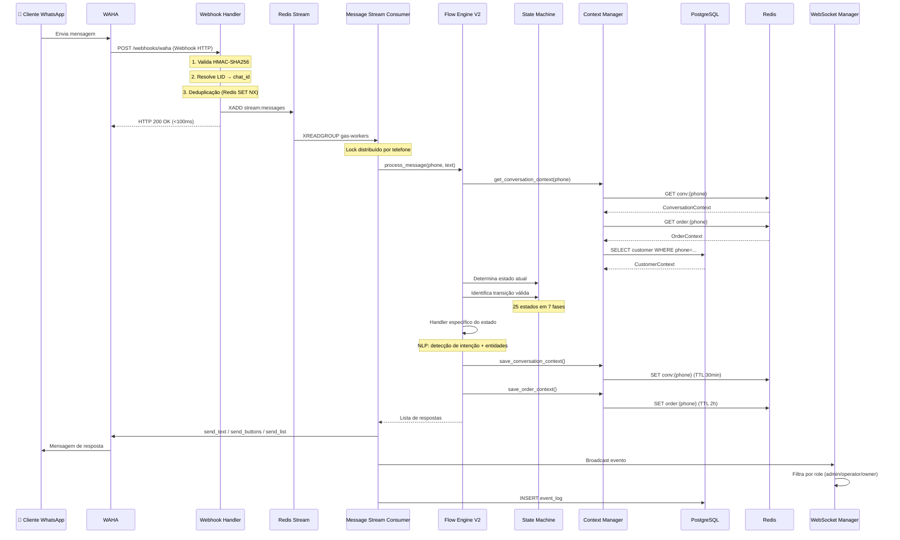
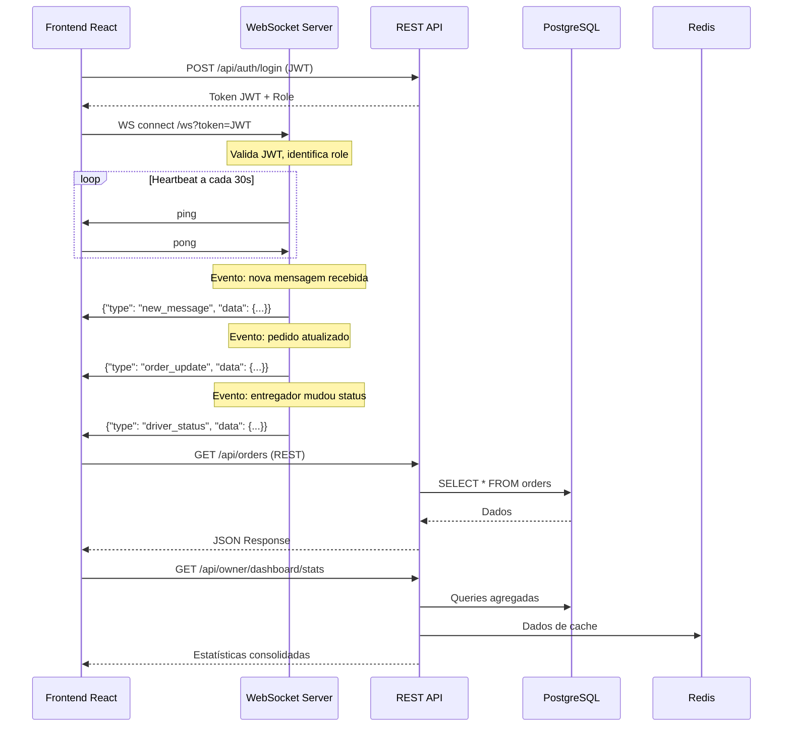
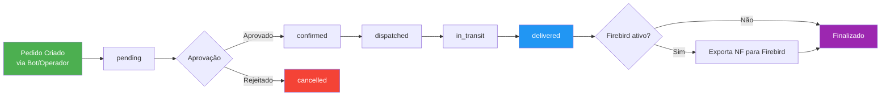
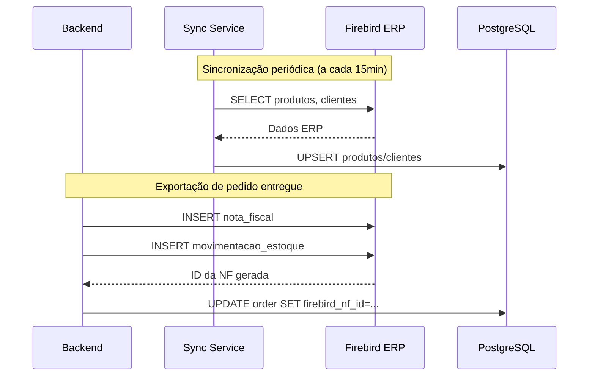
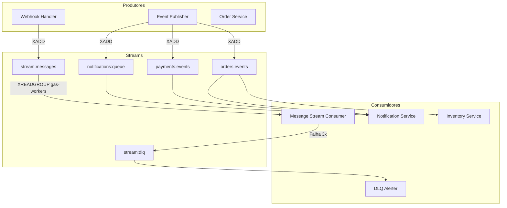
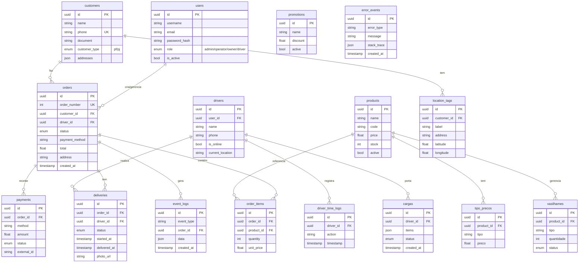
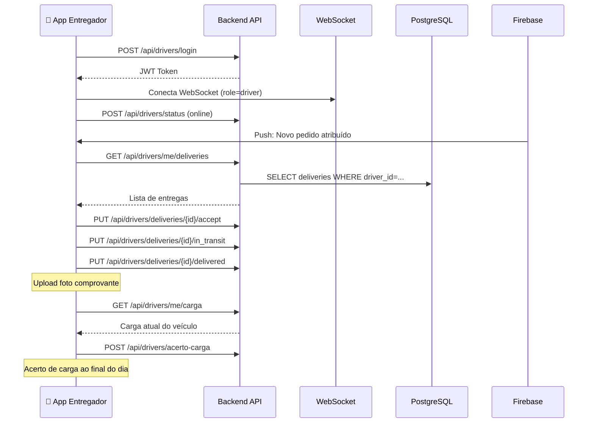
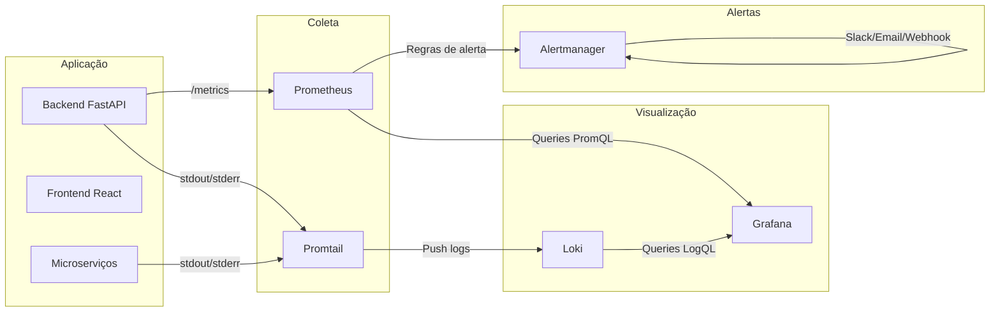
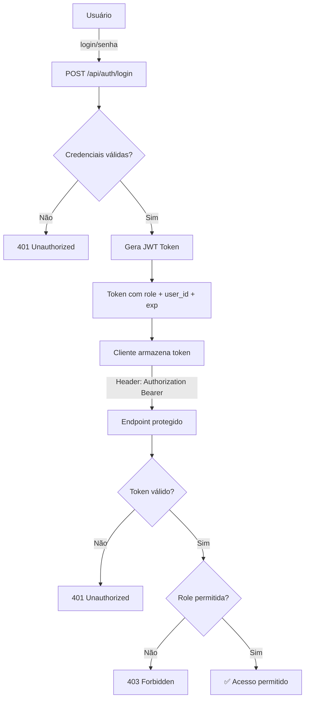

# Fluxo de Dados Completo — Gas Automation

> Documento técnico detalhado descrevendo todos os fluxos de dados do sistema, desde a entrada de mensagens do WhatsApp até a entrega final e integração fiscal.

---

## 📐 Visão Geral da Arquitetura

```mermaid
graph TB
    subgraph Clientes
        WA[📱 WhatsApp Cliente]
        MOB[📲 App Entregador - Capacitor/Android]
    end

    subgraph Infraestrutura Docker
        TRF[Traefik - API Gateway :80/:443]

        subgraph Backend
            API[FastAPI :8000]
            WSK[WebSocket Manager]
            FE[Flow Engine V2]
            SM[State Machine - 25 estados]
            NLP[NLP Engine]
            CM[Context Manager]
            MSC[Message Stream Consumer]
            EP[Event Publisher]
            WP[WAHA Poller]
        end

        subgraph Frontend
            REACT[React SPA :3001]
        end

        subgraph Bancos de Dados
            PG[(PostgreSQL 15 :5432)]
            RD[(Redis 7 :6379)]
        end

        subgraph Integrações
            WAHA[WAHA - WhatsApp HTTP API :3000]
            OLL[Ollama - IA Local :11434]
            FB[Firebird - ERP Legado]
            ASAAS[Asaas - Pagamentos]
            MINIO[MinIO - Object Storage :9000]
            FCM[Firebase Cloud Messaging]
        end

        subgraph Microserviços
            NOTIF[Notification Service :8001]
            INV[Inventory Service :8002]
            SYNC[Sync Service :8003]
        end

        subgraph Observabilidade
            PROM[Prometheus :9090]
            GRAF[Grafana :3002]
            ALERT[Alertmanager :9093]
            LOKI[Loki :3100]
            PTAIL[Promtail]
        end
    end

    WA -->|Mensagem| WAHA
    WAHA -->|Webhook POST| API
    API -->|Resposta| WAHA
    WAHA -->|Mensagem| WA

    API <-->|WebSocket| REACT
    API <-->|WebSocket| MOB
    API <-->|Async Queries| PG
    API <-->|Cache/Streams/Locks| RD
    API -->|Enviar Msg| WAHA
    API <-->|NLP/IA| OLL
    API <-->|Sync Produtos/NF| FB
    API -->|Pagamentos| ASAAS
    API <-->|Arquivos/Imagens| MINIO
    API -->|Push Notifications| FCM

    EP -->|Eventos| RD
    RD -->|Eventos| NOTIF
    RD -->|Eventos| INV

    SYNC <-->|Sync Bidirecional| FB
    SYNC <-->|Dados| PG

    PROM -->|Scrape| API
    PTAIL -->|Logs| LOKI
    GRAF -->|Queries| PROM
    GRAF -->|Queries| LOKI
    PROM -->|Alertas| ALERT
```



---

## 🔄 Fluxo 1 — Mensagem WhatsApp (Pipeline Principal)

Este é o fluxo central do sistema. Cada mensagem que um cliente envia no WhatsApp percorre este pipeline completo.



### Detalhes do Pipeline

| Etapa | Componente | Arquivo | Descrição |
|-------|-----------|---------|-----------|
| 1. Recepção | Webhook Handler | `app/api/webhooks.py` | Valida HMAC, resolve LID, deduplicação via Redis `SET NX` com TTL |
| 2. Enfileiramento | Redis Stream | `stream:messages` | `XADD` com Consumer Group `gas-workers` |
| 3. Consumo | Message Stream Consumer | `app/services/message_stream_consumer.py` | `XREADGROUP`, lock distribuído, batch de até 10 msgs |
| 4. Processamento | Flow Engine V2 | `app/core/flow_engine.py` → `flow_engine_v2.py` | Wrapper V1→V2, máquina de estados |
| 5. Contexto | Context Manager | `app/core/context_manager.py` | 3 contextos: Conversation (Redis), Customer (PG+Cache), Order (Redis) |
| 6. NLP | NLP Engine | `app/core/nlp_utils.py`, `nlu_engine_v2.py` | Detecção de intenção, extração de entidades |
| 7. Handlers | State Handlers | `app/core/handlers.py`, `handlers_v2/` | Handler por estado (produto, endereço, pagamento, etc.) |
| 8. Resposta | WAHA Client | `app/integrations/waha.py` | Envia texto, botões ou listas ao WhatsApp |
| 9. Broadcast | WebSocket Manager | `app/api/websocket.py` | Atualiza painéis em tempo real |
| 10. Fallback | DLQ | `stream:dlq` | Após 3 falhas, mensagem vai para Dead Letter Queue |

---

## 🤖 Fluxo 2 — Máquina de Estados (Conversação)

A conversa do cliente é gerenciada por uma State Machine com **25 estados** organizados em **7 fases**:

```mermaid
stateDiagram-v2
    [*] --> GREETING_INITIAL

    state "Fase 1: Saudação" as F1 {
        GREETING_INITIAL --> GREETING_RETURNING
    }

    state "Fase 2: Identificação" as F2 {
        GREETING_INITIAL --> IDENTIFY_TYPE
        GREETING_RETURNING --> IDENTIFY_TYPE
        IDENTIFY_TYPE --> IDENTIFY_NAME
        IDENTIFY_NAME --> IDENTIFY_DOCUMENT
    }

    state "Fase 3: Produto" as F3 {
        IDENTIFY_DOCUMENT --> PRODUCT_SELECT
        PRODUCT_SELECT --> PRODUCT_QUANTITY
        PRODUCT_QUANTITY --> PRODUCT_CONFIRM
        PRODUCT_CONFIRM --> PRODUCT_ADD_MORE
    }

    state "Fase 4: Endereço" as F4 {
        PRODUCT_ADD_MORE --> ADDRESS_SELECT
        ADDRESS_SELECT --> ADDRESS_NEW
        ADDRESS_NEW --> ADDRESS_COMPLEMENT
        ADDRESS_COMPLEMENT --> ADDRESS_CONFIRM
    }

    state "Fase 5: Pagamento" as F5 {
        ADDRESS_CONFIRM --> PAYMENT_METHOD
        PAYMENT_METHOD --> PAYMENT_CHANGE
        PAYMENT_CHANGE --> PAYMENT_CONFIRM
    }

    state "Fase 6: Conclusão" as F6 {
        PAYMENT_CONFIRM --> COMPLETE_SUMMARY
        COMPLETE_SUMMARY --> COMPLETE_CONFIRM
        COMPLETE_CONFIRM --> COMPLETE_FOLLOWUP
    }

    state "Fase 7: Suporte" as F7 {
        SUPPORT_HUMAN
        SUPPORT_FAQ
        TRACKING_STATUS
        TRACKING_OPTIONS
        ERROR_RECOVERY
    }

    COMPLETE_CONFIRM --> [*]
```

### Três Tipos de Contexto

| Contexto | Armazenamento | TTL | Dados |
|----------|--------------|-----|-------|
| **ConversationContext** | Redis | 30 min | Estado, sessão, contagem de msgs, `needs_human`, `waha_chat_id` |
| **CustomerContext** | PostgreSQL + Redis Cache | Permanente | Nome, CPF/CNPJ, endereços, último pedido, preferências, VIP |
| **OrderContext** | Redis | 2 horas | Itens, subtotal, taxa de entrega, endereço, pagamento, troco |

---

## 📊 Fluxo 3 — Dashboard e WebSocket (Tempo Real)



### Painéis por Role

| Role | Página | Dados em Tempo Real |
|------|--------|---------------------|
| **Admin** | `AdminDashboard.jsx` | Todos os pedidos, usuários, sistema, logs de auditoria, health check |
| **Operator** | `OperatorDashboard.jsx` | Conversas ativas, pedidos pendentes, chat com clientes |
| **Owner** | `OwnerDashboard.jsx` | Métricas financeiras, receita, performance, produtos mais vendidos |
| **Driver** | `DriverDashboard.jsx` | Pedidos atribuídos, rota, histórico de entregas, acerto de carga |

### Eventos WebSocket

| Evento | Direção | Descrição |
|--------|---------|-----------|
| `new_message` | Server → Client | Nova mensagem do WhatsApp |
| `message_sent` | Server → Client | Mensagem enviada com sucesso |
| `order_update` | Server → Client | Status de pedido alterado |
| `order_created` | Server → Client | Novo pedido criado |
| `driver_status` | Server → Client | Entregador mudou status (online/offline) |
| `conversation_update` | Server → Client | Conversa atualizada |
| `typing` | Client → Server | Operador está digitando |
| `operator_take` | Client → Server | Operador assumiu conversa |

---

## 🛒 Fluxo 4 — Ciclo de Vida do Pedido



### Dados persisidos por pedido

| Campo | Tabela | Descrição |
|-------|--------|-----------|
| `order_number` | `orders` | Número sequencial único |
| `customer_id` | `orders` → `customers` | FK para cliente |
| `items` | `order_items` | Produtos (P13, P20, P45), quantidade, preço unitário |
| `address` | `orders` | Endereço de entrega (com complemento) |
| `payment_method` | `orders` | Dinheiro, Cartão, PIX |
| `status` | `orders` | pending → confirmed → dispatched → in_transit → delivered |
| `driver_id` | `orders` → `drivers` | Entregador atribuído |
| `delivery` | `deliveries` | Dados de entrega (horário, assinatura, foto) |

### Side Effects por Status

| Transição | Ação Automática |
|-----------|-----------------|
| `→ confirmed` | Notifica cliente via WhatsApp, publica `order.confirmed` no Redis Stream |
| `→ dispatched` | Notifica entregador via push (FCM), publica `order.dispatched` |
| `→ delivered` | Notifica cliente, exporta para Firebird (se configurado), publica `order.delivered` |
| `→ cancelled` | Notifica cliente, libera estoque |

---

## 🔗 Fluxo 5 — Integrações Externas

### 5.1 WAHA (WhatsApp)

```
Frontend Operador → API → WAHA → WhatsApp
WhatsApp → WAHA → Webhook → API → Redis Stream → Consumer → Flow Engine
```

| Operação | Endpoint WAHA | Arquivo |
|----------|---------------|---------|
| Enviar texto | `POST /api/sendText` | `app/integrations/waha.py` |
| Enviar botões | `POST /api/sendButtons` | `app/integrations/waha.py` |
| Enviar lista | `POST /api/sendList` | `app/integrations/waha.py` |
| Marcar como lido | `PUT /api/markAsRead` | `app/integrations/waha.py` |
| Status "digitando" | `PUT /api/startTyping` | `app/integrations/waha.py` |
| Receber webhook | `POST /webhooks/waha` | `app/api/webhooks.py` |

### 5.2 Firebird (ERP)



| Operação | Direção | Arquivo |
|----------|---------|---------|
| Sync produtos | Firebird → PostgreSQL | `backend/services/sync-service/` |
| Sync clientes | Firebird → PostgreSQL | `backend/services/sync-service/` |
| Exportar NF | PostgreSQL → Firebird | `app/integrations/firebird.py` |
| Exportar movimentação | PostgreSQL → Firebird | `app/services/firebird_export_service.py` |

### 5.3 MinIO (Object Storage)

```
Upload imagem → API → MinIO (bucket: gas-automation)
Download imagem → API → MinIO → URL assinada
```

| Uso | Dados |
|-----|-------|
| Fotos de entrega | Comprovante fotográfico da entrega |
| Documentos | Exportações PDF/Excel |
| Imagens de produtos | Catálogo |

### 5.4 Pagamentos (Asaas)

```
Pedido confirmado → API → Asaas → Gera cobrança PIX/Boleto
Cliente paga → Asaas → Webhook → API → Atualiza status pagamento
```

### 5.5 Push Notifications (Firebase)

```
Evento no sistema → API → FCM → Push → App Entregador (Android)
```

| Evento | Destinatário |
|--------|-------------|
| Novo pedido atribuído | Entregador |
| Pedido cancelado | Entregador |
| Alteração de status | Cliente (futuro) |

### 5.6 Ollama (IA Local)

```
Mensagem do cliente → NLP Engine → Ollama → Intenção + Entidades
```

Usado para compreensão de linguagem natural avançada quando o NLP baseado em regras não é suficiente.

---

## 📡 Fluxo 6 — Redis Streams e Eventos

O Redis serve como barramento central de eventos e processamento assíncrono.



### Chaves Redis Importantes

| Chave | Tipo | TTL | Uso |
|-------|------|-----|-----|
| `conv:{phone}` | Hash/String | 30 min | Contexto da conversa |
| `order:{phone}` | Hash/String | 2 horas | Contexto do pedido em andamento |
| `customer:{phone}` | Hash/String | 1 hora | Cache do cliente |
| `lock:phone:{phone}` | String | 60s | Lock distribuído por telefone |
| `dedup:{message_id}` | String | 5 min | Deduplicação de mensagens |
| `stream:messages` | Stream | — | Fila de mensagens WhatsApp |
| `stream:dlq` | Stream | — | Dead Letter Queue |
| `orders:events` | Stream | 10k max | Eventos de pedidos |
| `payments:events` | Stream | 10k max | Eventos de pagamento |
| `notifications:queue` | Stream | 10k max | Fila de notificações |

---

## 🗄️ Fluxo 7 — Modelo de Dados (PostgreSQL)



---

## 📱 Fluxo 8 — App do Entregador (Mobile)



### Páginas do App

| Tela | Arquivo | Funcionalidade |
|------|---------|----------------|
| Login | `DriverLogin.jsx` | Autenticação do entregador |
| Dashboard | `DriverDashboard.jsx` | Pedidos pendentes, em rota, entregues |
| Detalhe da Entrega | `DeliveryDetail.jsx` | Endereço, cliente, mapa, ações |
| Histórico | `DeliveryHistory.jsx` | Entregas anteriores |
| Acerto de Carga | `AcertoCarga.jsx` | Reconciliação de estoque |
| Perfil | `DriverProfile.jsx` | Dados pessoais, estatísticas |

---

## 📈 Fluxo 9 — Observabilidade



### Métricas Expostas

| Métrica | Tipo | Descrição |
|---------|------|-----------|
| `gas_websocket_connections` | Gauge | Conexões WS ativas por role |
| `gas_messages_received_total` | Counter | Total de mensagens recebidas |
| `gas_messages_sent_total` | Counter | Total de mensagens enviadas |
| `gas_orders_total` | Counter | Total de pedidos por status |
| `gas_stream_consumer_running` | Gauge | Consumer está ativo |
| `gas_stream_lag` | Gauge | Lag do stream de mensagens |
| `gas_flow_engine_processing_seconds` | Histogram | Tempo de processamento |

---

## 🔐 Fluxo 10 — Autenticação e Autorização



### Roles e Permissões

| Role | Dashboard | Pedidos | Conversas | Entregadores | Usuários | Sistema |
|------|-----------|---------|-----------|--------------|----------|---------|
| **admin** | ✅ | CRUD | CRUD | CRUD | CRUD | ✅ Health, Logs |
| **owner** | ✅ Executivo | Leitura | Leitura | Leitura | — | — |
| **operator** | ✅ Operacional | Criar/Atualizar | Assumir/Responder | Atribuir | — | — |
| **driver** | ✅ Entregas | Próprios | — | Próprio | — | — |

---

## 🗂️ Resumo dos Endpoints REST

| Grupo | Prefixo | Arquivo | Principais Operações |
|-------|---------|---------|----------------------|
| Auth | `/api/auth` | `auth.py` | Login, refresh token, me |
| Users | `/api/users` | `users.py` | CRUD de usuários |
| Orders | `/api/orders` | `orders.py` | CRUD de pedidos, status |
| Products | `/api/products` | `products.py` | CRUD de produtos |
| Customers | `/api/customers` | `customers.py` | CRUD de clientes |
| Drivers | `/api/drivers` | `drivers.py` | CRUD, status, entregas, carga |
| Chats | `/api/chats` | `chats.py` | Conversas, histórico, assumir |
| Webhooks | `/webhooks` | `webhooks.py` | WAHA webhook |
| WebSocket | `/ws` | `websocket.py` | Tempo real |
| Owner | `/api/owner` | `owner_dashboard.py` | Dashboard executivo |
| Exports | `/api/exports` | `exports.py` | PDF, Excel, Firebird |
| Locations | `/api/locations` | `locations.py` | Tags de endereço, geocoding |
| Promotions | `/api/promotions` | `promotions.py` | CRUD de promoções |
| Images | `/api/images` | `images.py` | Upload/download MinIO |
| Cargas | `/api/cargas` | `cargas.py` | Gestão de cargas |
| Vasilhames | `/api/vasilhames` | `vasilhames.py` | Gestão de vasilhames |
| RPA | `/api/rpa` | `rpa.py` | Automação Gasmaster |
| DLQ | `/api/dlq` | `dlq.py` | Dead Letter Queue management |
| Admin | `/api/admin` | `admin_*.py` | Debug, errors, health, users |

---

## 🐳 Resumo dos Serviços Docker

| Serviço | Imagem | Porta | Profile | Dependências |
|---------|--------|-------|---------|-------------|
| **traefik** | traefik:v2.11 | 80, 443, 8080 | gateway | — |
| **postgres** | postgres:15-alpine | 5433→5432 | — | — |
| **postgres-backup** | prodrigestivill/postgres-backup-local | — | backup | postgres |
| **redis** | redis:7-alpine | 6379 | — | — |
| **waha** | devlikeapro/waha:latest | 3000 | — | redis, backend |
| **backend** | ./backend (FastAPI) | 8000 | — | postgres, redis |
| **ollama** | ollama/ollama:latest | 11434 | — | — |
| **frontend** | ./frontend (React) | 3001 | — | backend |
| **minio** | minio/minio:latest | 9000, 9001 | storage | — |
| **notification-service** | ./services/notification-service | 8001 | microservices | redis, backend |
| **inventory-service** | ./services/inventory-service | 8002 | microservices | redis, postgres |
| **sync-service** | ./services/sync-service | 8003 | — | postgres, redis |
| **prometheus** | prom/prometheus:latest | 9090 | monitoring | — |
| **grafana** | grafana/grafana:latest | 3002 | monitoring | prometheus |
| **alertmanager** | prom/alertmanager:latest | 9093 | monitoring | prometheus |
| **loki** | grafana/loki:latest | 3100 | monitoring | — |
| **promtail** | grafana/promtail:latest | — | monitoring | loki |
| **pgadmin** | dpage/pgadmin4:latest | 5050 | tools | postgres |
| **redis-commander** | rediscommander/redis-commander | 8081 | tools | redis |

---

*Gerado em: Março 2026 — Baseado na análise do código-fonte do projeto Gas Automation.*
