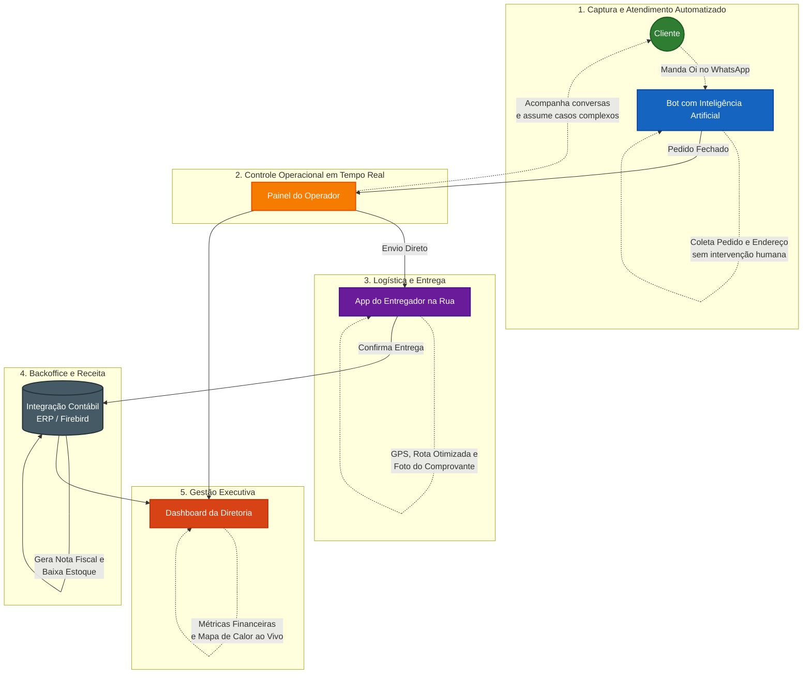

# Fluxo Executivo — Gas Automation

Este documento apresenta a operação do Gas Automation de forma clara e orientada a valor de negócio, ideal para apresentações à diretoria e investidores.

---

## 🚀 Visão Executiva do Negócio

Abaixo ilustramos como nossa plataforma transforma uma mensagem no WhatsApp em receita, de forma automatizada e com total rastreabilidade.

---

## 💼 Onde Geramos Valor?

| FASE | DIFICULDADE NO MODELO ANTIGO | SOLUÇÃO GAS AUTOMATION | BENEFÍCIO DIRETO |
| :--- | :--- | :--- | :--- |
| **Atendimento** | Linha ocupada, cliente espera no telefone, erros ao anotar. | Bot inteligente atende dezenas de clientes ao mesmo tempo via WhatsApp. | **Zero fila de espera.** Aumento de vendas retidas e satisfação do cliente. |
| **Operação** | Pilhas de papel, quadro branco desatualizado, mensagens perdidas. | Uma tela única digital mostrando todos os chats e status dos pedidos. | **Controle absoluto.** Redução de >80% nos erros operacionais. |
| **Entrega** | Motorista perde o papel do endereço ou volta para pegar mais pedidos. | App próprio no celular do motorista com a rota e baixa imediata. | **Economia de combustível** e entregas até 40% mais rápidas. |
| **Faturamento** | Fim do dia digitando nota fiscal à mão e conferindo estoque cego. | Integração robótica com o ERP que faz a baixa no momento da entrega. | **Gestão financeira 100% automatizada** e livre de erros tributários. |
| **Gestão** | Dono só sabe o lucro ou os problemas no dia seguinte. | Dashboard financeiro e mapa atualizando segundo a segundo na tela do gestor. | **Decisões baseadas em dados vivos.** Escalabilidade garantida. |

---

## 🎯 Por Que Investir / Usar?

*   **Não requer instalação para o cliente:** Ele já sabe usar o WhatsApp.
*   **Não aumenta a folha de pagamento para crescer:** O servidor (Docker/Cloud) escala sozinho de 100 para 10.000 pedidos/dia.
*   **Proteção financeira:** Todo troco, estoque (vasilhame) e comissão do entregador (acerto de carga) ocorre de forma matematicamente cravada e rastreável.
