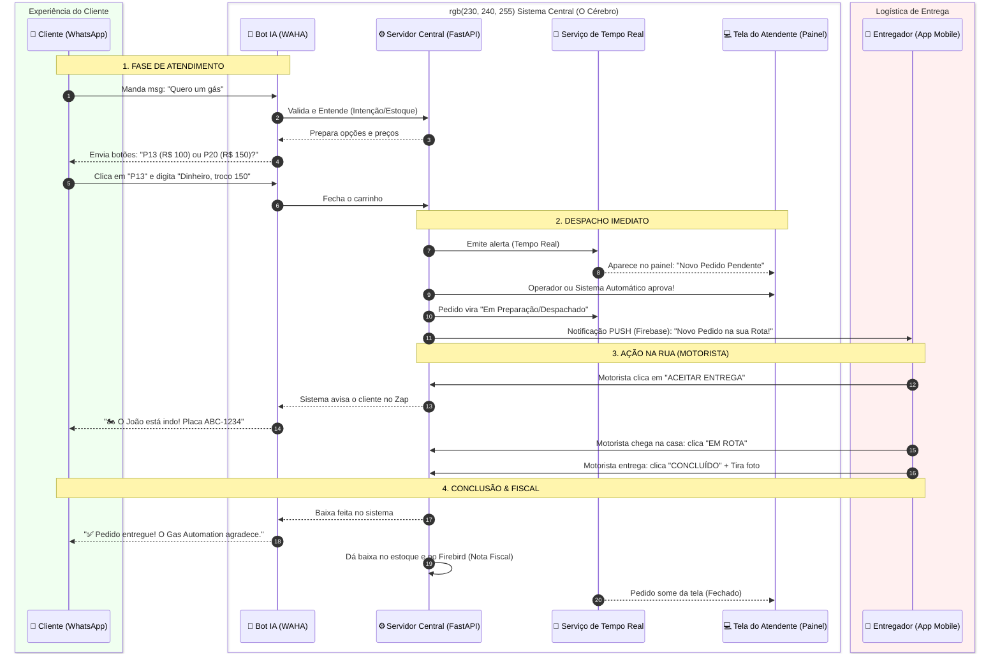

## 🚛 Jornada do Pedido: Do WhatsApp à Entrega

Este diagrama ilustra o passo a passo de como um pedido transita pelos sistemas do Gas Automation de forma contínua, invisível ao cliente e rápida para os entregadores.

---

### Explicando as Fases (Para Reunião):

1. **A Fricção Cai a Zero**: Sem baixar aplicativos, o cliente abre o Whats, fala do jeito dele e clica em 2 botões. Em menos de 20 segundos o pedido entra na base.
2. **O Painel é Vivo**: O atendente não dá *F5* para recarregar. Se um motoqueiro aprova no app, a cor do pedido na tela do supervisor muda no mesmo milissegundo (via WebSocket).
3. **Logística Sem Papel**: O motoboy recebe no próprio celular a coordenada GPS de onde ir sem precisar ficar mandando áudio ou errando quadra. E só continua para a próxima se a atual bater "Entregue".
4. **Fechamento Fiscal Invisível**: No segundo que o motoboy clica em *Concluído* a secretária não tem que digitar nada no fim da tarde. A integração avisa o banco de dados e fatura sozinho.
